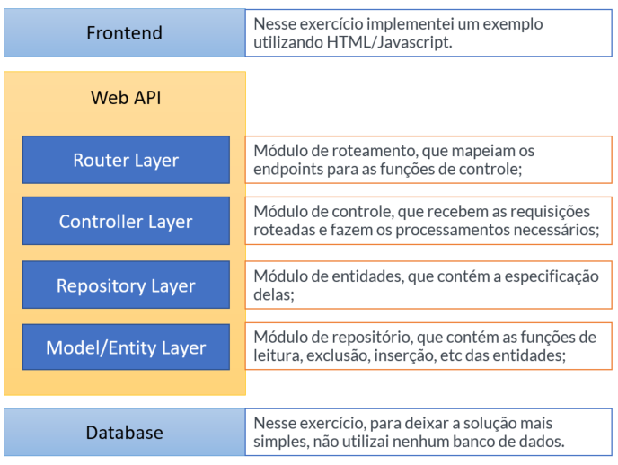
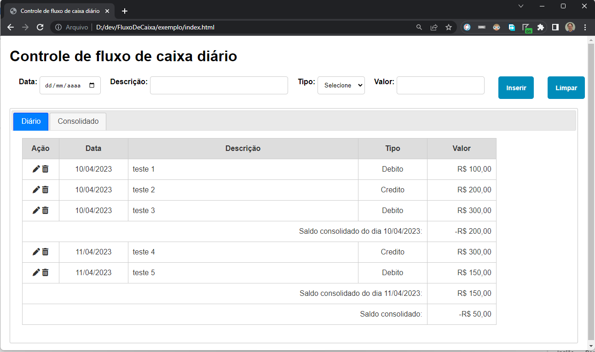
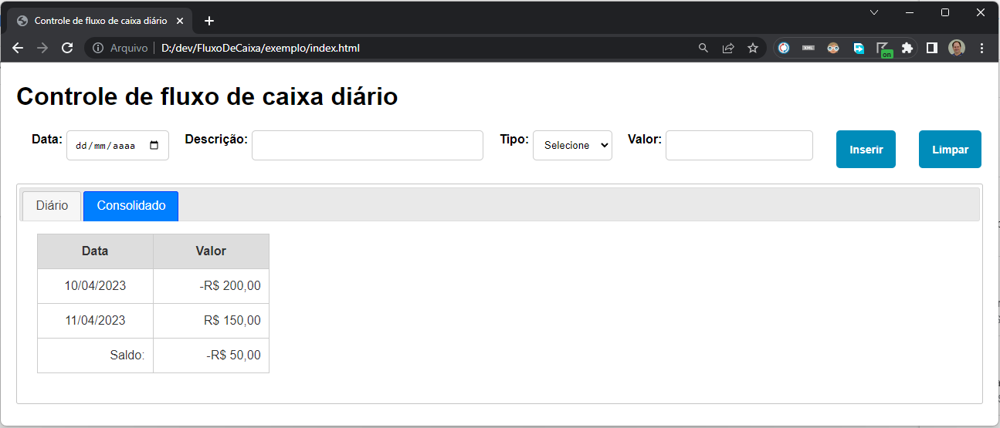

# Descritivo da Solução
Um comerciante precisa controlar o seu fluxo de caixa diário com os lançamentos (débitos e créditos), também precisa de um relatório que disponibilize o saldo diário consolidado.

# Requisitos de Negócio
- Serviço que faça o controle de lançamentos;
- Serviço do consolidado diário.

# Desenho da Solução

- Desenho da solução, e explicação não técnica do funcionamento da arquitetura;
- Readme com instruções de como subir a aplicação local, container e utilização dos serviços;

# Serviços implementados
- O serviço webapi está sendo executado no endereço http://localhost:3000/lancamento/v1/
- Serviços disponíveis:
    - “/all”, recupera todos os lançamentos (*)
    - “/consolidated:”, recupera todos os consolidados diários (*)
    - “/consolidated/:data”, recupera o consolidado diário de uma data especifica
    - “/get/:id”, recupera um lançamento passando o parâmetro do seu “id”
    - “/save”, inclui ou altera um determinado lançamento, recebe um objeto, se for passado o “id” neste objeto será realizado a alteração caso contrário será incluído;
    - “/delete/:id”, exclui o lançamento passando o parâmetro do seu “id”

    (*) Esse serviço foi implementado apenas para esse exercício, em produção o ideal implementar paginação.

# Estrutura do objeto json
    Lancamento {
        id: number;
        data: string;
        descricao: string;
        tipo: tipoLancamentoType;
        valor: number;
    }

# Começando
Primeiro, clone o repositório

```bash
cd FluxoDeCaixa # vá para o diretório raiz do projeto
npm install # instalar dependências de desenvolvimento
npm run dev # watch mode
npm run build # to build the project
```

# Desenvolvimento
```bash
npm run dev # watch mode
```

# Produção
```bash
npm run compile # to transpile TS to JS
npm run start # to build the project
```

# Exemplo
Com a solução em execução abra no navegador o arquivo index.html da pasta exemplo.

